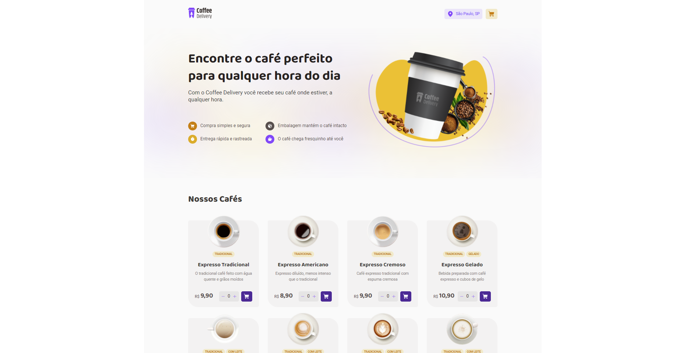

# coffee-delivery-ignite ☕



## Introduction
- This project was made as a solution to one of the RockeSeat Ignite course challenges. The project was created using Vite, React, Typescript, Styled Components, Zod (for forms) and Phosphor Icons.
- The challeng specifications are at [this notion page](https://efficient-sloth-d85.notion.site/Desafio-02-Coffee-Delivery-30e42a21fdb44b09a85244fc2c3dbdf9).
- The project design was built with figma, and distribuited with [this link](https://www.figma.com/file/5yT9ZzZmRQRS4yivGGB3pl/Coffee-Delivery/duplicate).

## Main Features
1. List coffees available for purchase
2. Add a specific amount of items in the cart
3. Increase/Descrease the amount of itens from cart
4. Use a form to fill address information
5. Exhibit the total cart items in the app Header
6. Show user the total price of the purchase

## Other Features
1. Maintain the items selected in the local storage
2. Get the address from an API based on post code (CEP in Brazil)
3. Validate that the user filled obrigatory address fields and warn if not
4. Recognize the user location based on his IP address

## Running the project
- To run this project, first clone it using this git command:
```sh
git clone https://github.com/flaviohblima/coffee-delivery-ignite.git
```
- Then, make sure you have [node](https://nodejs.org/en/) v16 or higher installed.
- Use `npm` or `yarn` to download the project dependecies.
```sh
npm install
# or
yarn install
```
- Then, use the `package.json` scripts to:
```sh
# run the application in development mode
npm run dev
# build the web app to production deployment
npm run build
# preview the builded web app (must run build before this command)
npm run preview
# perform linting od the app files, maintaining a pattern of code
npm run lint
```
- Vite will expose the app in two different paths:
  - Dev mode: http://127.0.0.1:5173/
  - Preview mode: http://127.0.0.1:4173/

- And, voilà, you are ready to use the app!

<br>
<hr>

```js
console.log("Thank you and happy coding 🤓☕");
```
<hr>